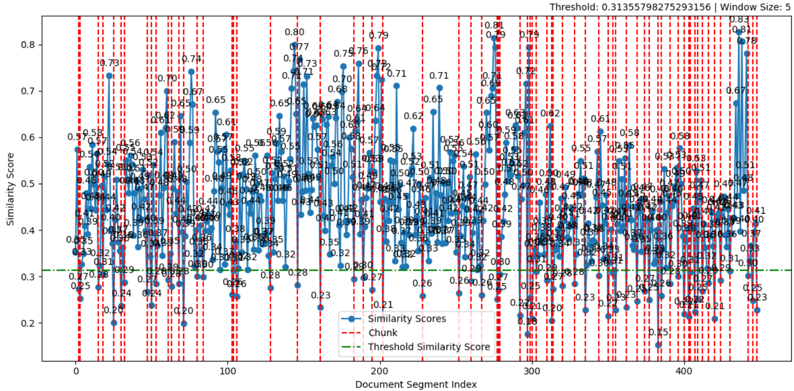

# Semantic Chunker for RAG

## Overview
The Semantic Chunker is a tool designed for Retrieval-Augmented Generation (RAG) workflows. It enables the efficient segmentation of text data into meaningful chunks to improve the retrieval and response generation processes. This is particularly useful for large documents where precise and semantically coherent chunking is critical for downstream tasks.

## Source
https://github.com/aurelio-labs/semantic-chunkers

## Sample Data
https://arxiv.org/pdf/2312.00752

## Key Features
- **Semantic-aware chunking:** Divides text based on semantic boundaries rather than arbitrary lengths.
- **Visual diagnostics:** Includes plots to analyze chunk distribution and quality.

## How it works

